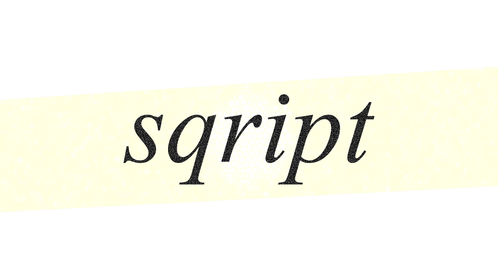

  

# sqript

> "sqript is a high level programming language meant to be the next Python"

## What does sqript bring?

  sqript brings the ease of use of Python, without the speed setbacks.
  Unlike Python sqript aims to be readable, thus there are semicolons and curly braces.

Beyond the visual perfection of the `qp` symmetry in its name, **sqript** is being designed to offer a highly structured, performant developer experience. 

**Planned Core Features:**
*   **Strict Typing:** Built-in type checking to catch errors before runtime.
*   **Object-Oriented Design:** First-class support for classes, namespaces, and standard class libraries.
*   **C-Style Syntax:** Curly braces and semicolons are mandatory for maximum readability and structure.
*   **Raw Speed:** Built to be fast enough to actually replace Python in performance-critical workflows.

## status

  <h1>🚨 EXTREMELY EARLY DEVELOPMENT 🚨</h1>
  <h2>WE DESPERATELY NEED CONTRIBUTORS!</h2>
  
<b>We are currently at day zero. The vision is set, but the codebase is just getting started. If you have experience with language design, parsers, or just want to help build the future of scripting, we really need people to join. Grab a shovel and help us dig!</b>

---

## The Roadmap

### Core Milestones
1.  **Phase 1: Bootstrapping in Rust  (or maybe another language we'll see)**    
    The initial compiler and runtime will be written entirely in Rust for maximum memory safety and performance.
3.  **Phase 2: Self-Hosting** 
    sqript becomes capable of compiling itself.
4.  **Phase 3: The Ecosystem** 
    Building out the standard libraries, class libraries, and package ecosystem.

### The Grand Vision (Long-term)
*   **Native UI:** Official RayGUI wrappers for seamless desktop application development.
*   **A New Web Paradigm:** Developing a separate web protocol and a dedicated browser built for sqript. Unlike standard sandboxed browsers, this will allow applications full, unhindered access to the host machine.

---

## Team
  
  <a href="https://github.com/Megamer-studios">
    
     
    <b>Akumarin Kukino</b>
  </a>
  &nbsp;&nbsp;&nbsp;&nbsp;

